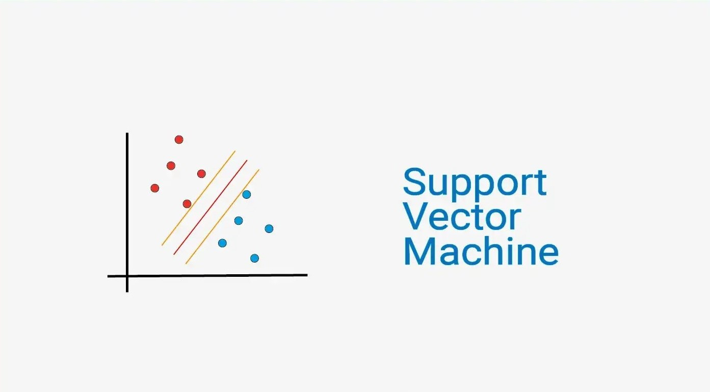
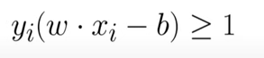
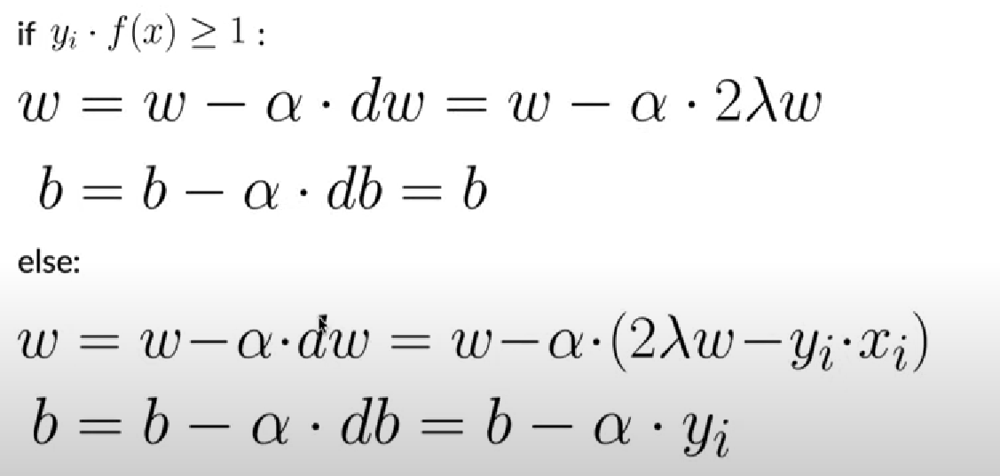
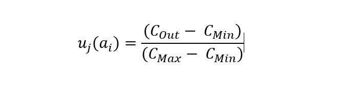

# List of contents
- [Title and Description](#Scholarship-Selection-System-using-SVM-&-SMART)
- [Alphorythm](#Algorithm)
   - [Support Vector Machine](#Support-Vector-Machine)
   - [Simple Multi Attribute Rating Technique](#Simple-Multi-Attribute-Rating-Technique)
- [Technology and Programming Language](#Technology-and-Programming-Language)
- [How to Run the Program](#How-to-Run-the-Program)
- [Live Demo](#Live-Demo)

# Scholarship-Selection-System-using-SVM-&-SMART
this project is a system that was built to overcome the tendency of errors in awarding scholarships, there are lots of cases related to this problem such as:
1. https://voicesikka.com/2022/07/17/beasiswa-salah-sasaran-area-rugi-rp-280-juta-jaksa-harus-periksa-kabag-kesra/
2. https://www.kompas.com/tren/read/2023/02/10/131500765/kip-kuliah-disebut-salah-sasaran-karena-penerimanya-nonton-konser-dan-beli?page=all
3. https://rakyatbengkulu.disway.id/read/645736/beasiswa-bpdpks-disepsi-salah-sasaran
   
This project uses 2 stages of selection, the first is using a support vector machine algorithm and the second is using a simple multi attribute rating technique expert system.

# Algorithm
## Support-Vector-Machine

Support Vector Machine (SVM) is one of the algorithms machine learning that is used to perform classification and regression.
The basic concept of a support vector machine (SVM), viz build a fruit hyperplane (separator) between the data with maximize the distance in each existing category.

The data used in the support vector machine is of type text data which has 4 columns:
1. Kartu Indonesia Pintar (KIP)
   has 2 types of value categories, namely yes and no
2. Penghasilan Orang Tua
   has 3 types of value categories, namely below 1 million, above 1 million and no income
3. Status Orang Tua Siswa
   has 3 types of categories namely complete, fatherless / motherless, orphan
4. Data Kemiskinan Dinas Sosial
   has 3 types of categories namely poor, vulnerable poor and normal
5. Target
   has 2 types of categories (yes / no)

Complete data can be seen [here](./dataset/data_final.csv)

In the process of creating a support vector machine model, I didn't use a library because the data has less complex values, so I decided to make manual svm calculations. The principle used is as shown in the following figure: 
<table>
  <tr>
      <td rowspan="2"></td>
      <td></td
  </tr>
  <tr>
      <td></td
  </tr>
</table>

the picture on the left is a concept from svm which looks for a hyperplane (delimiter line) to separate the 2 types of categories, in this project the categories to be separated are whether they pass or not.
in the picture on the right above illustrates the condition if the value is greater than 1 then there is a formula for changing the weight and bias, and vice versa. The point that can be taken from this svm calculation is to find the best weight and bias values based on the data.

The process of implementing a support vector machine using Python can be seen [here](./svm.py)
## Simple-Multi-Attribute-Rating-Technique

Simple Multi Attribute Rating Technique (SMART) is a method multi-criteria decision making developed by Edward in 1997. This multi-criteria decision-making technique is based on the theory that each alternative consists of a number of criteria that have values and each criterion has a weight that describes how important it is compared to other criteria.  

The data used in this smart has the same columns as in svm, the difference is that in this smart each column has its own weight value. This weight will be calculated by the smart model. The following are the weights for each dataset column:
1. Kartu Indonesia Pintar (KIP): 40%
2. Penghasilan Orang Tua: 10%
3. Status Orang Tua Siswa: 30%
4. Data Kemiskinan Dinas Sosial: 20%  

The process of calculating the smart method has several stages, namely:
1. Determine the utility value
The formula used to find utility values is as follows:

Information: 
uj(ai) = utility criterion-j, alternative -i 
cmax = maximum criterion value 
cmin = minimum criterion value 
cout = criterion value of the i-th alternative  

2. Ranking
The results of utility calculations will be added up for each row to produce a new column. The column is ranked in ascending order.

# Technology-and-Programming-Language
- Programming Language: Python
- Database: SQLite3
- Frontend: Streamlit

# How-to-Run-the-Program
1. install library (pip install -r requirements.txt).
2. Create a database (python database.py).
3. run the program (streamlit run Main.py)/

Make sure you have Python 3.7+ installed before running this program.

# Live-Demo
Live Demo : https://scholarship-system.streamlit.app/
